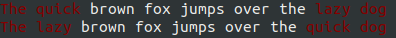

# text-color-render

根据文本的权重来渲染文本的深浅颜色，只依赖numpy。可以应用在NLP有关任务的可视化~

## 渲染效果

命令行效果：

Markdown效果：

使用matplotlib绘制成图像的效果：

这里使用`STKAITI.TTF`字体，侵删。

基于最长公共子序列高亮差异部分：

基于最长公共子串高亮差异部分：

真实场景示例（匹配）：

## 应用

这是我在NLP用的一些可视化应用：

[text-globalmaxpool-visualization](https://github.com/allenwind/text-globalmaxpool-visualization)

[text-attentionpooling-visualization](https://github.com/allenwind/text-attentionpooling-visualization)

[text-integrated-gradients](https://github.com/allenwind/text-integrated-gradients)

[text-glyph-in-NLU](https://github.com/allenwind/text-glyph-in-NLU)

